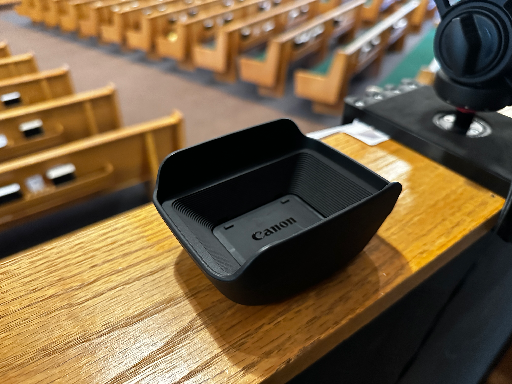
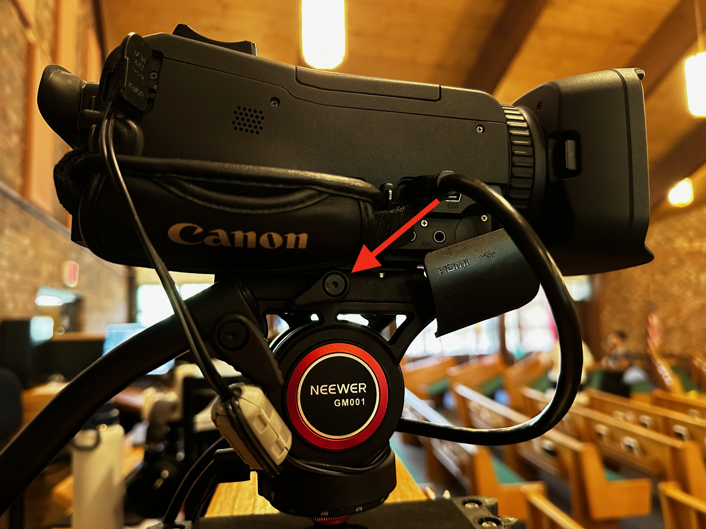
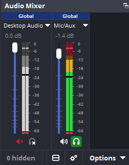

# Stream Instructions

These instructions will walk you through setting up a Sunday service livestream, what do do during a livestream, and how to shut down the stream after the service finishes. If you need to learn some basics of how to operate OBS, see [OBS Basics](Stream/OBS%20Basics.md). If you want more details on how the stream works, see the [Stream Documentation](Stream/OBS%20Documentation.md). If you want more details on how the stream PC works, see the [Windows Documentation](Windows/Windows%20Documentation.md).

## 1. Turn on the Stream PC

The Stream PC is currently in a transition phase between two different installations of Windows. Eventually this will be resolved and you will be able to just press the power button to start the computer, but until then there are a few instructions you need to follow to properly start the Stream PC.

*Note that some of these instructions will require quick action. Read through all of them before starting to follow them.*

1. Turn on the monitors. Not much more than the manufacturer logos should appear on them.
2. Press the power button on the side of the PC. **Quickly move to the next instruction.**
3. Upon seeing the **Pro Series** logo (or before), rapidly and repeatedly press the **[F11]** key on the keyboard. Keep pressing until you see a menu with the title **"Please select boot device"**.
4. Select the second option on the list, which should be **Windows Boot Manager (CT500P3SSDD8)**. You can select it using either the mouse or the arrow keys. There is no time limit for this step.
5. The PC will now boot into the correct Windows installation.

## 2. Sign in to the RiversideAG profile

The user profile shown at startup may not be the RiversideAG profile, so make sure to sign in as RiversideAG. If you don't know or have access to the password, ask someone else on the media booth team for it.

## 3. Check for software updates

*Note that this may be handled automatically in the future, so this step may eventually be removed.*

If you are not particularly tech-literate, you can skip this step.

1. Open the **Terminal** app as administrator. Opening as administrator ensures you shouldn't have to confirm anything during updates.
2. Run the command `winget update` to check for updates.
3. If OBS is listed as updateable, run the command `winget update OBSProject.OBSStudio`. This makes sure OBS is updated before all other software, so you can get to using it faster.
4. Run `winget update --all` to upgrade all the other software with updates available. You can do other things while this runs.

## 4. Open OBS

You can open OBS from the desktop, the task bar, or the start menu. It should open on the second monitor.

## 5. Set up the camera

1. Take the camera out of its case and replace the lense cover with the lense hood.

    

2. Slide the camera into the camera mount on top of the media booth wall. Twist the knob on the right side of the mount to tighten its grip on the camera.

    

3. Connect both the power cable and the mini-HDMI cable to the camera.

4. Turn on the camera and open its viewfinder.

5. Ensure that the video from the camera is visible in OBS. If you can't see it under the **Main** scene, see *Camera Troubleshooting*.

## 6. Prepare to start recording

At this point the livestream/recording is—from a technical perspective—ready to go. However, there are still a few things that should be done before starting the recording.

1. Move the video from the camera into the **Program** window in OBS. You can do this by selecting the **Main** scene and clicking the **Cut** or **Fade** buttons.

    *Insert screenshot of OBS window.*

2. Point the camera at the stage. How the video is framed will depend on what's happening on stage, but generally it's a good idea to start it with the piano and chior chairs both in frame.

3. Make sure OBS is receiving audio from the sound system. The **Mic/Aux** column in the OBS audio mixer should show some movement when someone talks into a microphone. Alternatively you can just put on the headphones connected to the computer and check that you can hear sound.

    

    If you can't hear or see anything, see *Sound Troubleshooting*.

## 7. Start recording

Once someone starts talking to the audience on stage—or ideally just before—you can start recording. Often someone will start playing music just before the service officially starts, so that can be a good time to start recording as well. Don't worry about the exact moment you start—the recording can always be cropped to start a bit later.

You can start recording by clicking the **Start Recording** button in OBS.

## 8. Record the service

For the rest of the service, you must manage the recording. There are no strict instructions for this since each service is different, but here are a few general practices to follow:

- When there is music, put everyone who is singing or playing on stage in frame.
- Move the camera up a bit during prayer or offering time. We want to give people a bit of privacy so they don't have to be on camera when going to the alter. There's no strict requirement to keep people off-camera, though. We just do this to be considerite, so don't worry if there's still some people in-frame.
- When someone is speaking, put them in frame, though not too tightly. You want them to be able to move around a little bit and still be in frame without moving the camera. You don't need to keep them strictly in the center of the frame, it's OK for them to wander.
- If someone is speaking from the audience and you can't hear them on the recording (which will usually be the case), don't worry about pointing the camera at them. This should generally be edited out of the recording afterwards, since the viewer can't hear what's happening.
- Cut or fade to the slides feed when someone specifically mentions something on the slides long enough that viewers would be able to absorb the whole image.

Ultimately, however, you have the descretion to choose how you apply these practices or to choose when not to follow them.

## 9. Stop the recording

Once everyone is dismissed and the service is over, you can stop the recording by clicking the **Stop Recording** button in OBS. Typically you should click the **Fade to Black (3000ms)** button before stopping the recording, which fades the recording to black for 3 seconds, but that's just to make the ending look a bit better, it's not strictly necessary.

## 10. Edit the recording

*If you don't know how to edit videos, you can skip this step, someone else will take care of it.*

Some videos will require additional edits, but typically there are 3 things to do:

1. Cut the beginning of the video to start at the beginning of the service. If there were serious technical difficulties at the beginning of the service, you can start after those issues.
2. Cut out any significant portions of the service where nothing's happening on camera (Ex. greeting time). Generally a significant portion is more than a minute long, though this is up to the editor's discretion.
3. Add audio fades to the beginning and end of the service for a smoother transition. This can be skipped if you're pressed for time.

The end result of the edit should be a video which shows every part of the service where there are things to show on camera and nothing else.

## 11. Shut down the computer

Close any applications you have open and shut down the computer through the start menu.

## 12. Put away the camera

1. Turn off the camera and close its viewfinder.
2. Disconnect the power cable and the mini-HDMI cable from the camera.
3. Loosen the knob on the right side of the mount and press the red button on the left side of the mount to take the camera out of the mount.
4. Replace the lense hood with the lense cover and put the camera back in its case.
